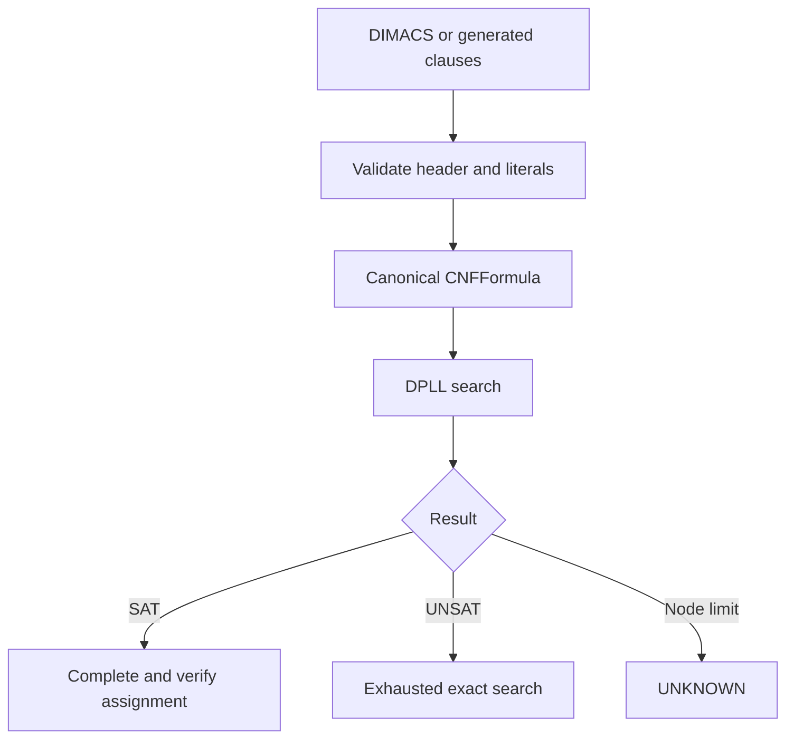

# Architecture

## Supported data flow

### Formula layer

`CNFFormula` stores clauses as immutable tuples of signed integers. Variable
identifiers are one-based to match DIMACS. Construction validates literal
ranges, and parsing validates the declared clause count before preprocessing.

Preprocessing performs satisfiability-preserving transformations:

1. remove repeated literals within a clause;
2. remove tautological clauses containing both `x` and `-x`;
3. remove repeated clauses;
4. remove a clause when a retained shorter clause subsumes it;
5. retain empty clauses as explicit UNSAT evidence.

Unlike the historical tensor mask, these operations always preserve clause
boundaries.

### Exact solver

Every search step operates on the current formula, so solver behavior is
formula-conditioned by construction. DPLL applies:

- unit propagation until a fixed point;
- pure-literal elimination;
- a deterministic Jeroslow-Wang-style literal score;
- two-way branching and complete backtracking.

With no node limit, reaching a contradiction on every branch proves UNSAT. A
SAT result is completed across all declared variables and checked against the
original `CNFFormula` before it is returned.

### Search limits

`max_nodes` is an operational guard, not a heuristic answer. Reaching it raises
an internal stop signal that becomes `SolveStatus.UNKNOWN`. Callers can
therefore distinguish exact results from incomplete searches.

### Validation oracle

`brute_force_solve` enumerates every assignment up to a configurable variable
limit. It is deliberately independent of DPLL and is used in property tests and
small benchmark cross-checks.

## Why there is no learned solver in the supported package

The preserved policy emits the same assignment distribution for every formula,
so extending it would not be a defensible learned SAT system. A future learned
path would need, at minimum:

1. a sign-aware literal–clause incidence representation;
2. a permutation-aware graph or set encoder;
3. immutable train, validation, and test instance manifests;
4. assignment verification and exact small-instance optima;
5. equal candidate or wall-time budgets against random search, local search,
   DPLL/CDCL baselines, and ablations;
6. multiple training and evaluation seeds with uncertainty intervals.

Such a model should be introduced as a separate package component only after
its input dependence and evaluation protocol are covered by tests.
