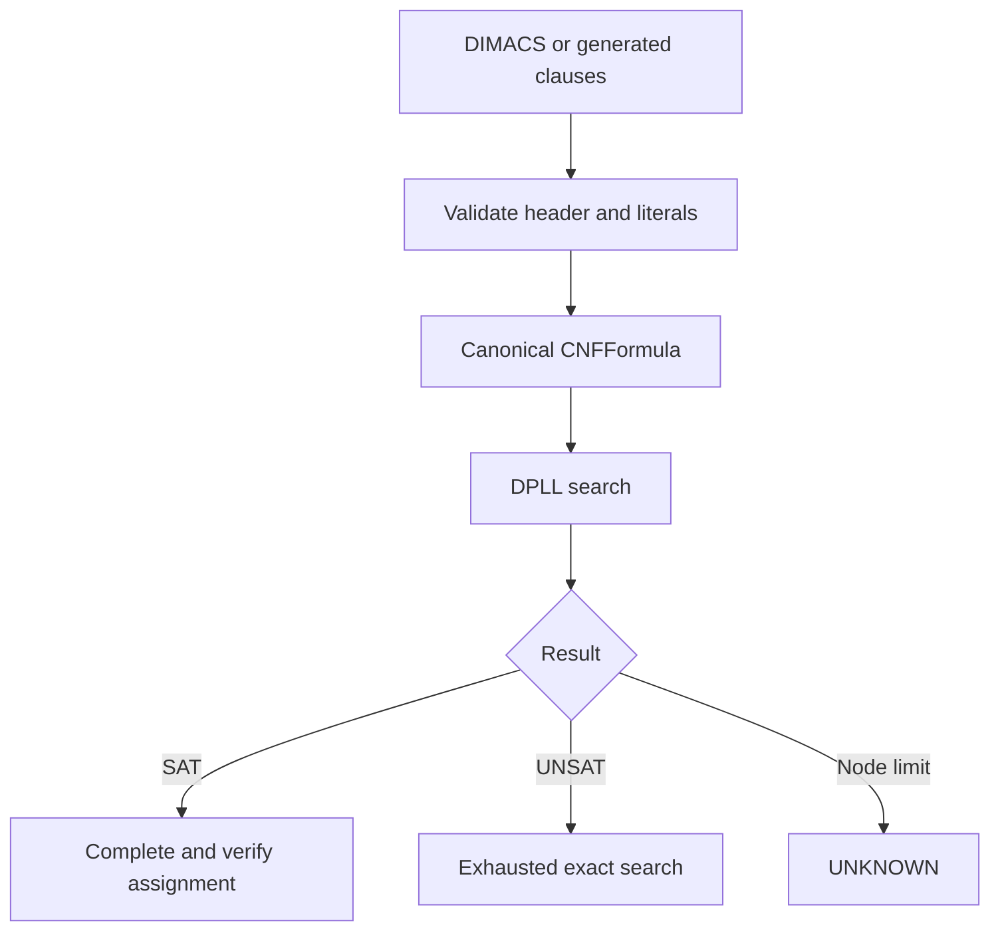

# Architecture

## Supported data flow

### Formula layer

`CNFFormula` stores clauses as immutable tuples of signed integers. Variable
identifiers are one-based to match DIMACS. Construction validates literal
ranges, and parsing validates the declared clause count before preprocessing.

Preprocessing performs satisfiability-preserving transformations:

1. remove repeated literals within a clause;
2. remove tautological clauses containing both `x` and `-x`;
3. remove repeated clauses;
4. remove a clause when a retained shorter clause subsumes it;
5. retain empty clauses as explicit UNSAT evidence.

Unlike the historical tensor mask, these operations always preserve clause
boundaries.

### Exact solver

Every search step operates on the current formula, so solver behavior is
formula-conditioned by construction. DPLL applies:

- unit propagation until a fixed point;
- pure-literal elimination;
- a deterministic Jeroslow-Wang-style literal score;
